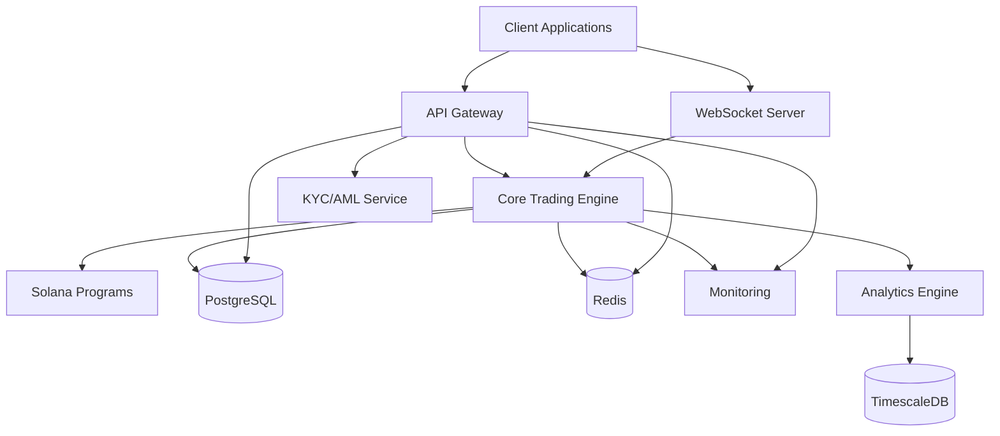
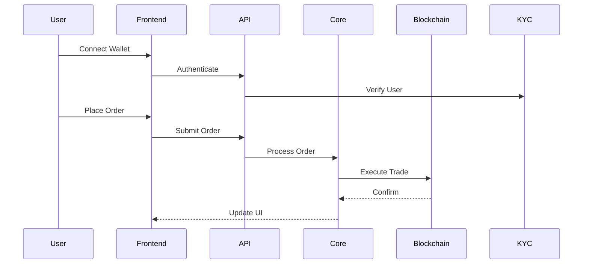

# DEX Platform Architecture Document

Version: 1.0.0
Date: 2024-12-19
Author: Jayanth Kumar
Status: In Progress

## Introduction

### Overview
The DEX (Decentralized Exchange) platform is a high-performance trading system built with Rust, Go, and Solana. The system is designed to provide secure, scalable, and efficient trading capabilities while maintaining decentralization principles.

### Related Documents
- Product Requirements Document (PRD): [Link Pending]
- System Requirements Specification (SRS): [Link Pending]
- API Documentation: [Link Pending]
- Deployment Guide: [Link Pending]

### Use Cases & Target Users
1. Retail Traders
   - Spot trading
   - Liquidity provision
   - Token swaps
   - Portfolio tracking
   - Transaction history
2. Institutional Users
   - High-frequency trading
   - Market making
   - Large volume transactions
   - Advanced analytics
3. DeFi Integrators
   - Protocol-to-protocol interactions
   - Cross-chain bridges
   - Aggregator services
4. Compliance Officers
   - KYC/AML monitoring
   - Regulatory reporting
   - Transaction surveillance

## High Level Design

### Technology Stack

#### Backend Core
- Rust
  - Tokio (async runtime)
  - Serde (serialization)
  - Rocket (web framework)
- Go
  - Gin (web framework)
  - GORM (ORM)
  - Go-ethereum (Ethereum client)

#### Blockchain Integration
- Solana Web3.js
- Anchor Framework
- Web3.js (Ethereum compatibility)

#### Infrastructure
- PostgreSQL (primary database)
- Redis (caching layer)
- Docker & Kubernetes
- Prometheus & Grafana
- ELK Stack (logging)

#### Frontend (Integration Specs)
- React with Web3 React
- Real-time WebSocket updates
- Wallet integration support

### System Architecture Diagram



### User Flow Architecture



## Detailed Design

### 1. Core Trading Engine (Rust)

#### Components
1. Order Book Management
   ```rust
   pub struct OrderBook {
       bids: PriceQueue,
       asks: PriceQueue,
       market_id: MarketId,
       last_update: Timestamp,
   }
   ```

2. Market Making System
   - AMM Implementation
   - Constant Product Formula
   - Dynamic Fee Adjustment
   - Liquidity Pool Management
   ```rust
   pub struct LiquidityPool {
       token_a: TokenAccount,
       token_b: TokenAccount,
       total_shares: u64,
       fee_tier: FeeTier,
   }
   ```

3. Risk Management Module
   - Position Limits
   - Circuit Breakers
   - Price Impact Protection
   - Anti-fraud Monitoring

### 2. User Management System

#### KYC/AML Integration
```rust
pub struct UserVerification {
    user_id: UUID,
    kyc_level: KYCTier,
    verification_status: VerificationStatus,
    documents: Vec<Document>,
    risk_score: f64,
}
```

#### Wallet Integration
```typescript
interface WalletConnection {
    provider: Web3Provider;
    chainId: number;
    address: string;
    signMessage(message: string): Promise<string>;
    sendTransaction(tx: Transaction): Promise<string>;
}
```

### 3. Analytics Engine

#### Time-Series Data Model
```sql
CREATE TABLE market_data (
    time TIMESTAMPTZ NOT NULL,
    market_id TEXT,
    price NUMERIC(20,8),
    volume NUMERIC(20,8),
    liquidity NUMERIC(20,8)
) PARTITION BY RANGE (time);

CREATE TABLE user_analytics (
    time TIMESTAMPTZ NOT NULL,
    user_id UUID,
    trading_volume NUMERIC(20,8),
    fees_paid NUMERIC(20,8),
    profit_loss NUMERIC(20,8)
);
```

## DevOps Infrastructure

### CI/CD Pipeline
```yaml
stages:
  - test
  - build
  - deploy

test:
  script:
    - cargo test
    - go test ./...
    - anchor test

build:
  script:
    - docker build -t dex-platform .

deploy:
  script:
    - kubectl apply -f k8s/
```

### Monitoring Setup
1. Metrics Collection
   - Trading volume
   - Order latency
   - System resources
   - Error rates
2. Alerting Rules
   - High error rate alerts
   - Latency threshold alerts
   - Security incident alerts
3. Dashboard Templates
   - Trading overview
   - System health
   - Security monitoring

## Security Considerations

### Attack Vectors & Mitigations
1. Front-running Protection
   - MEV resistance
   - Order delay mechanism
2. Smart Contract Security
   - Formal verification
   - Multiple audits
   - Bug bounty program
3. Infrastructure Security
   - Network segmentation
   - DDoS protection
   - Regular penetration testing
4. User Security
   - 2FA requirement
   - Hardware wallet support
   - Session management

## Scalability Considerations

### Performance Metrics
1. Order Processing
   - Latency: < 100ms
   - Throughput: 10,000 TPS
2. Infrastructure
   - High availability: 99.99%
   - Geographic distribution
   - Redundancy
3. Data Management
   - Automatic data partitioning
   - Hot/Cold storage strategy
   - Backup and recovery procedures

## Compliance Framework

### Regulatory Requirements
1. KYC/AML Procedures
   - Identity verification
   - Transaction monitoring
   - Suspicious activity reporting
2. Reporting Requirements
   - Daily trading reports
   - Monthly compliance reports
   - Annual audits
3. Data Retention
   - Transaction history: 7 years
   - User data: 5 years
   - Trading logs: 2 years

## Open Items

1. Cross-chain bridge implementation details
2. Oracle fallback mechanism
3. Governance token economics
4. Advanced order types implementation
5. Market maker incentive program
6. Cross-margin trading support

## Review Meeting Minutes

### Initial Architecture Review (2024-03-19)
1. Action Items
   - Enhance security measures for cross-chain transactions
   - Implement comprehensive monitoring system
   - Design disaster recovery procedures
2. Decisions
   - Use Rust for core engine
   - Implement hybrid storage solution
   - Deploy on multiple regions
3. Next Steps
   - Begin KYC integration
   - Set up development environment
   - Initialize core repositories